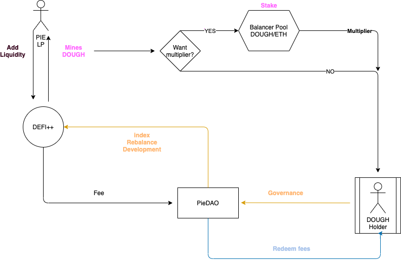
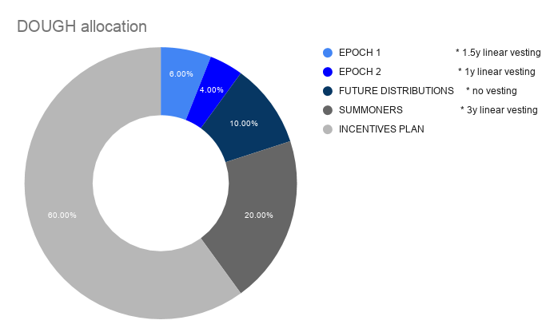
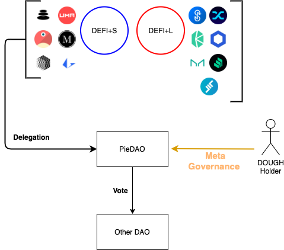

# Pieconomics

## Key Summary 

* DOUGH will migrate to DOUGHv2 at will, at a rate of 1 DOUGH per 1 DOUGHv2.
* Token requests will be accepted until the date of deployment of DOUGHv2.
* At the time of migration, DOUGHv2 will be vested according to [PIP 12 vesting schedule](../approved-proposals/pip-11-phase-0-staking-and-delegation.md).
* DOUGHv2 will be used to seed pairs like for instance DEFI++/DOUGHv2.
* DOUGHv2 can entitle for the redemption of streaming fees generated by Pies.
* PieDAO will launch a liquidity mining program in DOUGHv2.
* PieDAO will launch a bounty program in DOUGHv2.

## Introduction 

This proposal is a synthesis of Pieconomics - a path to the migration of DOUGH to DOUGHv2.

DOUGHv2 releases act as a catalyst for the growth of the PieDAO ecosystem, Pieconomics introduces a  framework that leverages financial incentives and multilevel governance to prioritize the sustainability of PieDAO and minting of Pies.

## DOUGH Token Migration 

The migration to DOUGHv2 marks the first step in transitioning governance to [Phase 0 - Staking and Delegation](../approved-proposals/pip-11-phase-0-staking-and-delegation.md).

DOUGH will migrate to DOUGHv2 at a rate of 1 DOUGH per 1 DOUGHv2.

To start the migration, DOUGH will be used to vote on the governance vote to deploy the smart contracts responsible for converting DOUGH to DOUGHv2.

## DOUGHv2 Incentives 

PieDAO will be able to create Ecosystem Incentives for supplying liquidity to Pies.

The liquidity mining program rewards liquidity provision of Pies and introduces a multiplier for the long term LPs in the DOUGHv2/ETH pool.  
  
**How liquidity mining works:**

* LP mint DOUGHv2 by adding liquidity to Pies like DEFI+S and DEFI++.
* At the moment of claiming the DOUGHv2, if the LP voluntarily stakes DOUGHv2 rewards in the DOUGHv2/ETH pool, rewards are multiplied.

Fees generated by Pies, in the form of Pie tokens \(ie: DEFI++\), are added to the Balancer pool to grow the market until the DAO decides otherwise.  
  
**What are streaming fees?**  
The streaming fees are paid out to the DAO linearly over time based on the entire market cap of the Pie \(ie: 1% of market cap over 1 year\).   
  
The streaming fee is calculated linearly and can be claimed by anyone, anytime by calling the appropriate function in the Pie smart contract.   
  
**Other rewards**

The community may also decide to allocate rewards to applications built on top of the PieDAO ecosystem via the Bounty program. The decision to integrate new incentives will be performed through decentralized governance of DOUGHv2 holders.

## PieDAO Governance

After DOUGHv2, PieDAO governance will be managed by [pie-crust](https://github.com/pie-dao/pie-crust), a module that calculates the voting weight of holders based on the sum of DOUGHv1 and DOUGHv2 both.  
  
`Vote weight = (DOUGH+DOUGHv2)`

## FAQ

#### How to get DOUGHv2? 

You can convert your DOUGH to DOUGHv2 at a 1:1 ratio, otherwise, you can obtain DOUGHv2 by providing liquidity to Pies or acquiring it from the open market.

#### When will DOUGHv2 released?

Saturday 3rd of October 1:00 PM UTC.

#### What is the supply of DOUGH and DOUGHv2 combined?

Total supply combined is 100M and distributed as such over the years:

* 60% for incentives distributed to Liquidity providers and Developers over the years.
* 20% Summoners of the DAO with 3 years vesting.
* 10% of early DOUGH contributors \(_Epoch 1 / Epoch 2_\).
* 10% for future distribution.

Vesting happens linearly every second.

#### What is DOUGHv2 used for?

DOUGHv2 is the governance token with value accrual from Pies fees.

* Govern [Pies Parameters](https://docs.piedao.org/papers/piedao-the-asset-allocation-dao#parameters-to-govern).
* Meta-governance for those tokens with governance capabilities inside the Pies.
* Value capture via fees redemption of the different pies \(_currently not enabled_\).
* Staking and delegation \(once deployed by governance, later in time\).

#### **What is Meta-Governance?**

Pie Smart Pools like DEFI+S contains, among others, governance tokens of other protocols. For this reason, DOUGH holders will be in control of different tokens which can be used to govern DeFi protocols. **By voting with DOUGH, PieDAO’s members decide how those tokens should vote in the specific DAO**.

#### Are DOUGH token holders migrating to DOUGHv2 subject to vesting?

Yes, to align incentives early token requests were accepted at a lower rate than later ones but are subject to longer vesting periods. DOUGH holders are subject to the following vesting schedules:

* Contribution on Epoch 1 \(from block to block\) 1.5y vesting
* Contribution on Epoch 2 \(from block to block\) 1y vesting
* Summoners 3y vesting
* Bounties, no vesting applied

The vesting windows start at the moment the DOUGH v1 tokens were minted for your address according to  [PIP 12 vesting schedule](../approved-proposals/pip-11-phase-0-staking-and-delegation.md).

  

